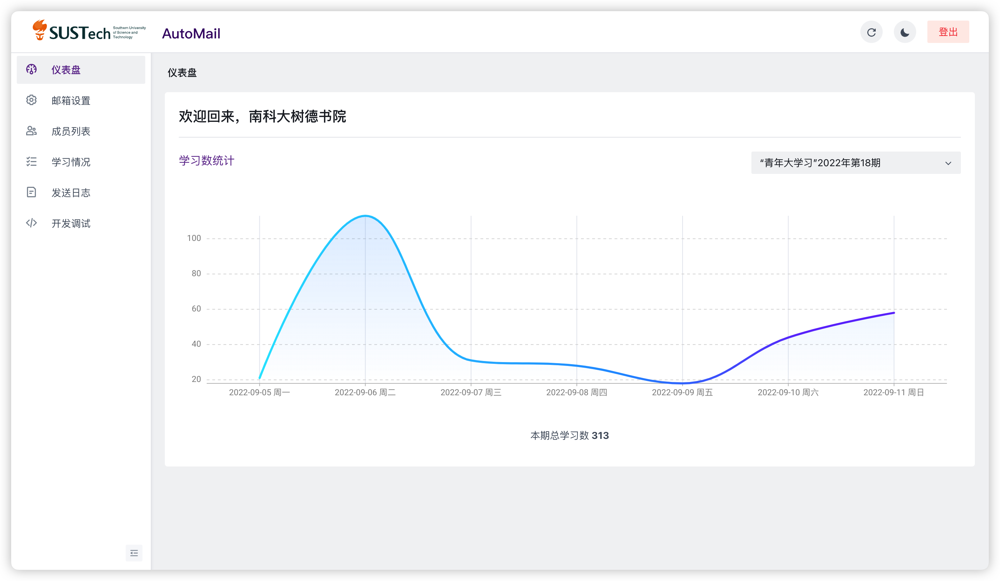
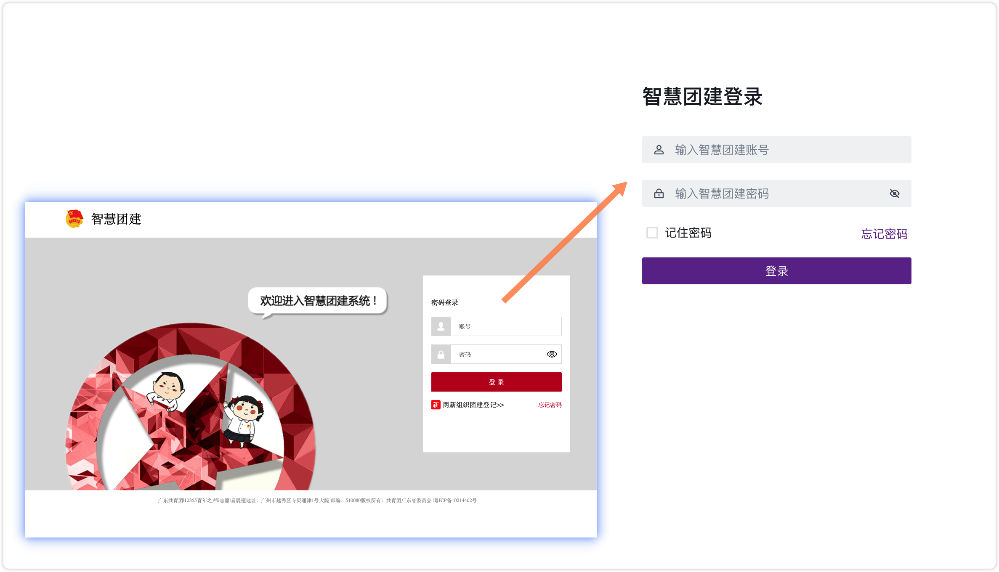
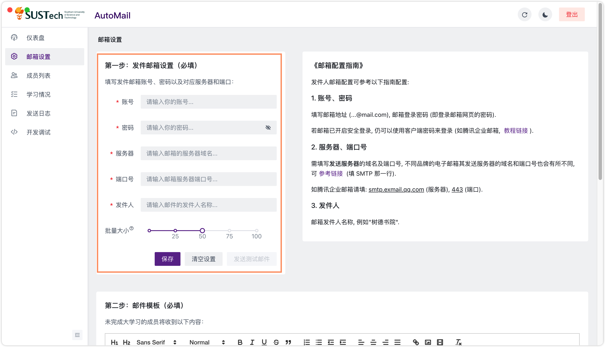
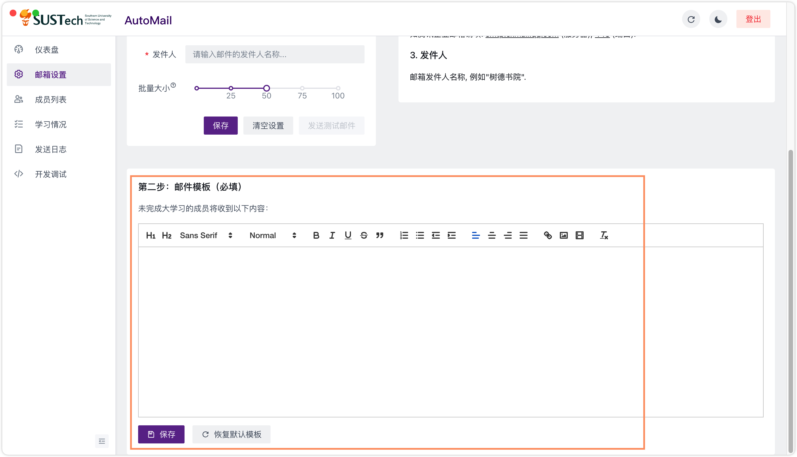
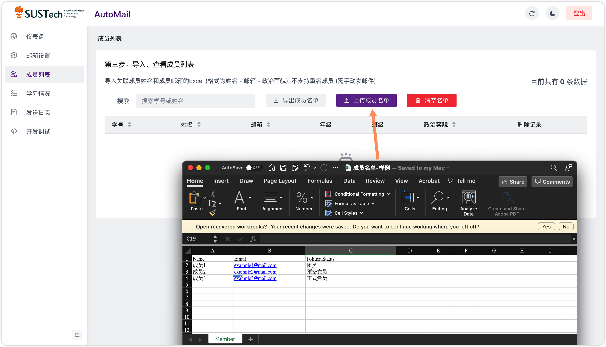
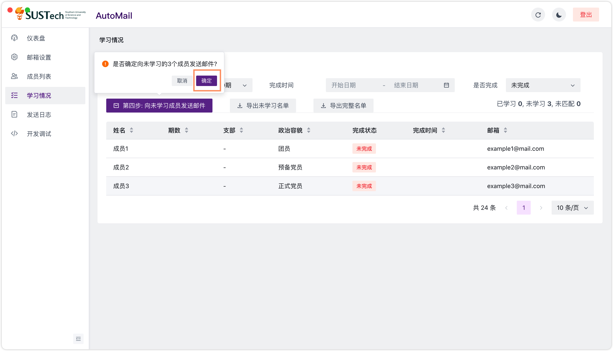

# 青年大学习一键邮件提醒

基于 React + Electron 的广东省青年大学习一键提醒邮件客户端



# 基本原理

用户上传成员姓名与邮箱的 Excel 表格 → 客户端从 [tuan.12355.net](https://tuan.12355.net) 后台获取各期大学习已学习成员 → 在原有的 Excel 表格中，通过姓名匹对筛选出未学习成员名单 → 发送提醒邮件

# 功能

📈 仪表盘

- 监控每期学习数随日期的变化趋势

⚙️ 邮件设置

- 配置发件邮箱账号、密码、服务器、端口号、邮件分批发送的数量以及发件人名称
- 自定义邮件模板，支持上传图片

🎓 成员列表

- 一键导入、导出、清空成员
- 支持搜索栏搜索

📋 学习情况

- 查询、导出各期大学习已完成同学的表单
- 自动根据姓名匹对，若发现成员没有出现在已完成列表，中则标记为未完成
- 支持以时间、是否完成过滤表单
- 一键向未学习的同学发送提醒邮件（若人数过多，邮件将分批发送）

📝 发送日志

- 记录邮箱发送情况（若邮件发送失败，能够查询报错日志）
- 支持搜索栏搜索

# 快速开始

## 0. 登录智慧团建

输入智慧团建账号密码



## 1. 配置邮箱

输入发件邮箱的账号密码、服务器端口号、以及发件人名称 → 点击测试邮件 → 查看是否受到测试邮件



## 2. 配置邮件模板

在编辑框中输入邮件模板，或使用默认模板 → 点击保存



## 3. 上传成员

上传成员列表（姓名 - 邮箱 - 政治容貌）



## 4. 发送邮件

发送提醒邮件



# 开发

```bash
// 初始化项目
yarn install

// 开发模式: 打开前端服务器 + 开启Electron窗口
yarn start
yarn electron

// 打包: 打包React + 打包Electron
yarn build
yarn build-electron
```
